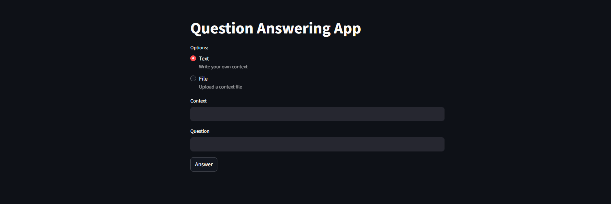
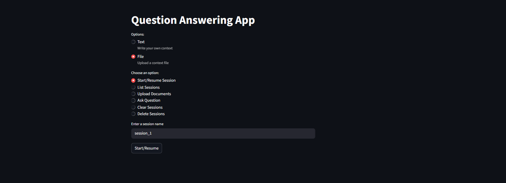
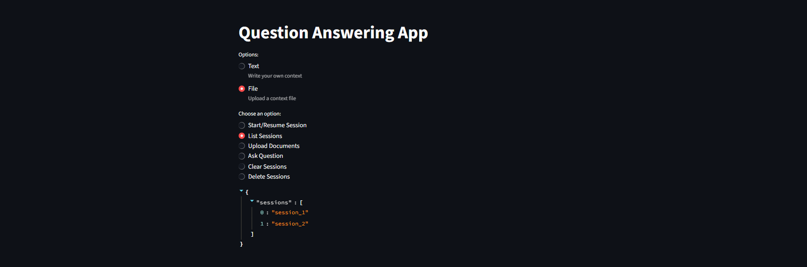
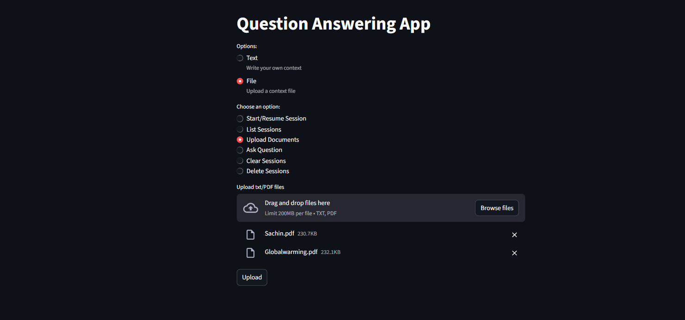
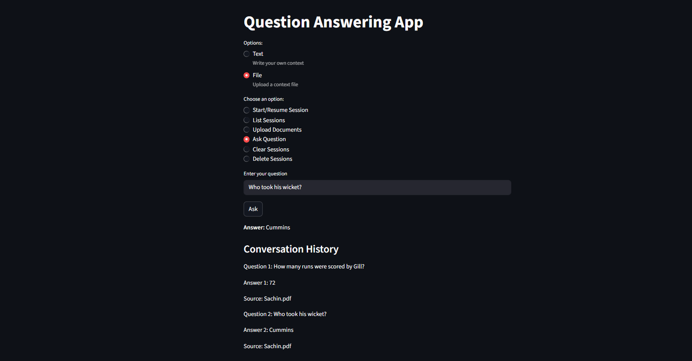
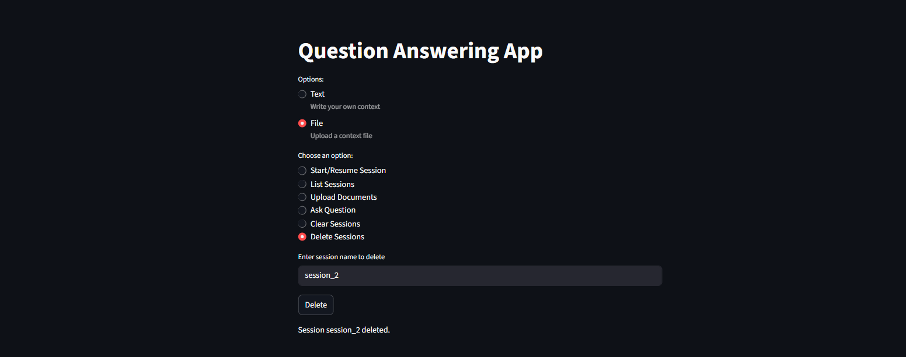
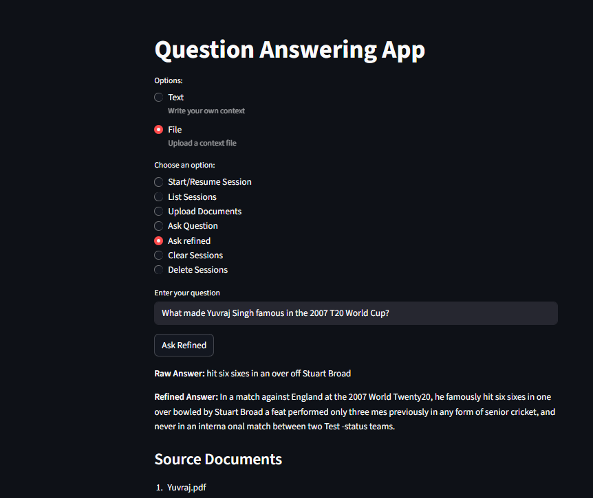

# Question Answering App: Flask + Hugging Face + Streamlit (RAG)

This is a Context based question answering app built with Flask and hugging face.
It uses [deepset/roberta-base-squad2 model](https://huggingface.co/deepset/roberta-base-squad2) 
to extract answer from a given context. It also has a feature to upload multiples .pdf or .txt and
extract answer from them. It can also store history of conversation and can reply contextually.

## Features

* By default app has a context about journey of Indian cricket team and answers the predefined questions
such as: 
Who was the captain when India won its first World Cup in 1983?
When did India win the inaugural ICC T20 World Cup?

* GET  / : Response with a welcome message
* POST /ask:  accepts a context and question and returns the answer and it's confidence score
* POST /ask_file: to upload multiple(.txt/.pdf) for context
* POST /ask_docs: to retrieve answers from the uploaded docs
* POST /start_session: creates a session ID
* POST /ask_session to extract answer contextually
* POST /ask_refined: Generative Answer Refinement 
* Start Session: To start a new or resume an old session
* List Session: To check the list of existing sessions
* Clear Session: To clear current history and session
* Delete Session: To Delete a session
* Used Streamlit for UI
* Chromadb to save the uploaded files
> Using Hugging Face's pipeline: 'question-answering'

## Technologies Used:

* Python
* Flask
* Hugging face
* Streamlit
* Chromadb

## Installation:

1. Clone the repository:
<pre> git clone https://github.com/yourusername/Question_Answering_App.git 
 cd Question_Answering_App </pre>

2. Set up the environment
<pre> python -m venv venv
 venv\Scripts\Activate</pre>

3. Install dependecies
<pre>pip install -r requirements.txt</pre>

4. Run the application
<pre>python app.py</pre>
<pre>streamlit run streamlit.py</pre>

### 'Text' option:

### 'File' option

1. Start or Resume a Session

2. List all existing sessions

3. Upload multiples pdf/txt files

4. Ask a question from uploaded files

5. Clear history/Session

6. Delete a session

7. Generative Answer

